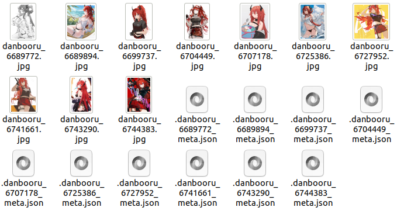

# waifuc

[](https://pypi.org/project/waifuc/)


[](https://github.com/deepghs/waifuc/actions?query=workflow%3A%22Code+Test%22)
[](https://github.com/deepghs/waifuc/actions?query=workflow%3A%22Package+Release%22)
[](https://codecov.io/gh/deepghs/waifuc)


[](https://github.com/deepghs/waifuc/stargazers)
[](https://github.com/deepghs/waifuc/network)

[](https://github.com/deepghs/waifuc/issues)
[](https://github.com/deepghs/waifuc/pulls)
[](https://github.com/deepghs/waifuc/graphs/contributors)
[](https://github.com/deepghs/waifuc/blob/master/LICENSE)

Efficient Train Data Collector for Anime Waifu.

**This project is still under development, official version will be released soon afterwards.**

If you need to use it immediately, just clone it and run `pip install .`.

## Installation

PyPI version is not ready now, please install waifuc with source code.

```shell
pip install git+https://github.com/deepghs/waifuc.git@main#egg=waifuc
```

If your operating environment includes available CUDA, you can use the following installation command to achieve higher

```shell
pip install git+https://github.com/deepghs/waifuc.git@main#egg=waifuc[gpu]
```

If you need to process with videos, you can install waifuc with

```shell
pip install git+https://github.com/deepghs/waifuc.git@main#egg=waifuc[video]
```

For more information about installation, you can refer
to [Installation](https://deepghs.github.io/waifuc/main/tutorials/installation/index.html).

## An Example

### Quickly Get Character's Dataset

Grab surtr (arknights)'s dataset for LoRA Training

```python
from waifuc.action import NoMonochromeAction, FilterSimilarAction, \
    TaggingAction, PaddingAlignAction, PersonSplitAction, FaceCountAction, FirstNSelectAction, \
    CCIPAction, ModeConvertAction, ClassFilterAction, RandomFilenameAction, AlignMinSizeAction
from waifuc.export import TextualInversionExporter
from waifuc.source import GcharAutoSource

if __name__ == '__main__':
    # data source for surtr in arknights, images from many sites will be crawled
    # all supported games and sites can be found at
    # https://narugo1992.github.io/gchar/main/best_practice/supported/index.html#supported-games-and-sites
    # ATTENTION: GcharAutoSource required `git+https://github.com/deepghs/waifuc.git@main#egg=waifuc[gchar]`
    s = GcharAutoSource('surtr')

    # crawl images, process them, and then save them to directory with given format
    s.attach(
        # preprocess images with white background RGB
        ModeConvertAction('RGB', 'white'),

        # pre-filtering for images
        NoMonochromeAction(),  # no monochrome, greyscale or sketch
        ClassFilterAction(['illustration', 'bangumi']),  # no comic or 3d
        # RatingFilterAction(['safe', 'r15']),  # filter images with rating, like safe, r15, r18
        FilterSimilarAction('all'),  # filter duplicated images

        # human processing
        FaceCountAction(count=1),  # drop images with 0 or >1 faces
        PersonSplitAction(),  # crop for each person
        FaceCountAction(count=1),

        # CCIP, filter the character you may not want to see in dataset
        CCIPAction(min_val_count=15),

        # if min(height, weight) > 800, resize it to 800
        AlignMinSizeAction(800),

        # tagging with wd14 v2, if you don't need character tag, set character_threshold=1.01
        TaggingAction(force=True),

        PaddingAlignAction((512, 512)),  # align to 512x512
        FilterSimilarAction('all'),  # filter again
        FirstNSelectAction(200),  # first 200 images
        # MirrorAction(),  # mirror image for data augmentation
        RandomFilenameAction(ext='.png'),  # random rename files
    ).export(
        # save to surtr_dataset directory
        TextualInversionExporter('surtr_dataset')
    )

```

### Quick Crawl Images from Websites

The following code will give you 10 images of surtr (arknights) with metadata saved.

```python
from waifuc.action import HeadCountAction, AlignMinSizeAction
from waifuc.export import SaveExporter
from waifuc.source import DanbooruSource

if __name__ == '__main__':
    source = DanbooruSource(['surtr_(arknights)', 'solo'])
    source.attach(
        # only 1 head,
        HeadCountAction(1),

        # if shorter side is over 640, just resize it to 640
        AlignMinSizeAction(640),
    )[:10].export(  # only first 10 images
        # save images (with meta information from danbooru site)
        SaveExporter('/data/surtr_arknights')
    )

```

And this is what's in `/data/surtr_arknights` afterwards



Similarly, you can crawl from pixiv with similar code, just by changing the source

```python
from waifuc.action import HeadCountAction, AlignMinSizeAction, CCIPAction
from waifuc.export import SaveExporter
from waifuc.source import PixivSearchSource

if __name__ == '__main__':
    source = PixivSearchSource(
        'アークナイツ (surtr OR スルト OR 史尔特尔)',
        refresh_token='use_your_own_refresh_token'
    )
    source.attach(
        # only 1 head,
        HeadCountAction(1),

        # pixiv often have some irrelevant character mixed in
        # so CCIPAction is necessary here to drop these images
        CCIPAction(),

        # if shorter side is over 640, just resize it to 640
        AlignMinSizeAction(640),
    )[:10].export(  # only first 10 images
        # save images (with meta information from danbooru site)
        SaveExporter('/data/surtr_arknights_pixiv')
    )
```

This is what you can get at `/data/surtr_arknights_pixiv`


Here is a list of website source we currently supported

| Name                                              | Import Statement                              |
|:--------------------------------------------------|:----------------------------------------------|
| [ATFBooruSource](https://booru.allthefallen.moe)  | from waifuc.source import ATFBooruSource      |
| [AnimePicturesSource](https://anime-pictures.net) | from waifuc.source import AnimePicturesSource |
| [DanbooruSource](https://danbooru.donmai.us)      | from waifuc.source import DanbooruSource      |
| [DerpibooruSource](https://derpibooru.org)        | from waifuc.source import DerpibooruSource    |
| [DuitangSource](https://www.duitang.com)          | from waifuc.source import DuitangSource       |
| [E621Source](https://e621.net)                    | from waifuc.source import E621Source          |
| [E926Source](https://e926.net)                    | from waifuc.source import E926Source          |
| [FurbooruSource](https://furbooru.com)            | from waifuc.source import FurbooruSource      |
| [GelbooruSource](https://gelbooru.com)            | from waifuc.source import GelbooruSource      |
| [Huashi6Source](https://www.huashi6.com)          | from waifuc.source import Huashi6Source       |
| [HypnoHubSource](https://hypnohub.net)            | from waifuc.source import HypnoHubSource      |
| [KonachanNetSource](https://konachan.net)         | from waifuc.source import KonachanNetSource   |
| [KonachanSource](https://konachan.com)            | from waifuc.source import KonachanSource      |
| [LolibooruSource](https://lolibooru.moe)          | from waifuc.source import LolibooruSource     |
| [PahealSource](https://rule34.paheal.net)         | from waifuc.source import PahealSource        |
| [PixivRankingSource](https://pixiv.net)           | from waifuc.source import PixivRankingSource  |
| [PixivSearchSource](https://pixiv.net)            | from waifuc.source import PixivSearchSource   |
| [PixivUserSource](https://pixiv.net)              | from waifuc.source import PixivUserSource     |
| [Rule34Source](https://rule34.xxx)                | from waifuc.source import Rule34Source        |
| [SafebooruOrgSource](https://safebooru.org)       | from waifuc.source import SafebooruOrgSource  |
| [SafebooruSource](https://safebooru.donmai.us)    | from waifuc.source import SafebooruSource     |
| [SankakuSource](https://chan.sankakucomplex.com)  | from waifuc.source import SankakuSource       |
| [TBIBSource](https://tbib.org)                    | from waifuc.source import TBIBSource          |
| [WallHavenSource](https://wallhaven.cc)           | from waifuc.source import WallHavenSource     |
| [XbooruSource](https://xbooru.com)                | from waifuc.source import XbooruSource        |
| [YandeSource](https://yande.re)                   | from waifuc.source import YandeSource         |
| [ZerochanSource](https://www.zerochan.net)        | from waifuc.source import ZerochanSource      |

### 3-Stage-Cropping of Local Dataset

This code is loading images from local directory, and crop the images with 3-stage-cropping method (head, halfbody, full
person), and then save it to another local directory.

```python
from waifuc.action import ThreeStageSplitAction
from waifuc.export import SaveExporter
from waifuc.source import LocalSource

source = LocalSource('/your/path/contains/images')
source.attach(
    ThreeStageSplitAction(),
).export(SaveExporter('/your/output/path'))

```
